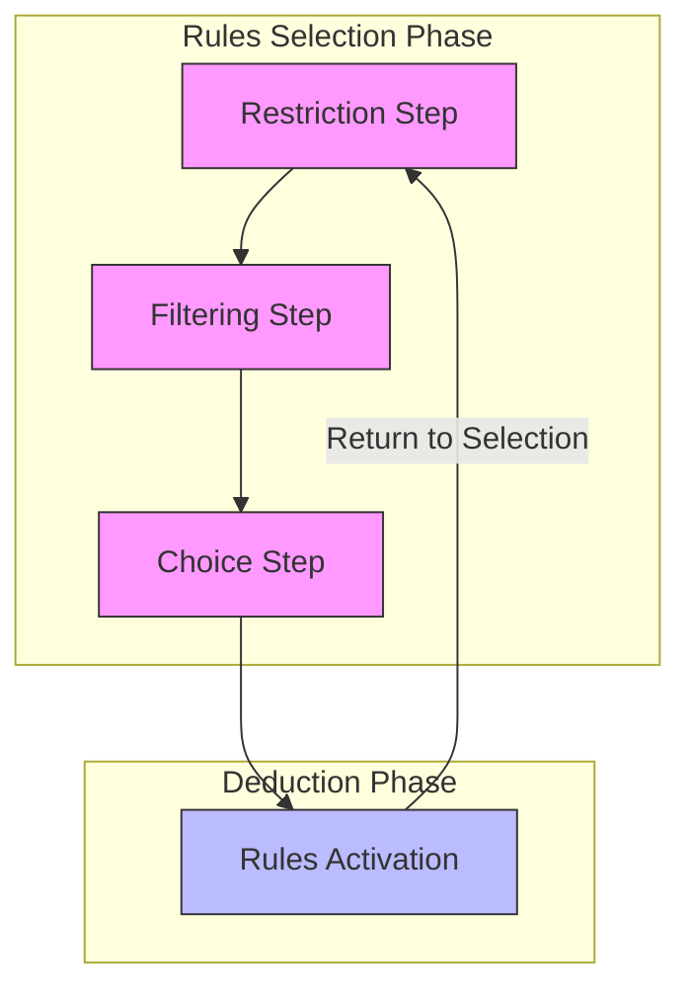
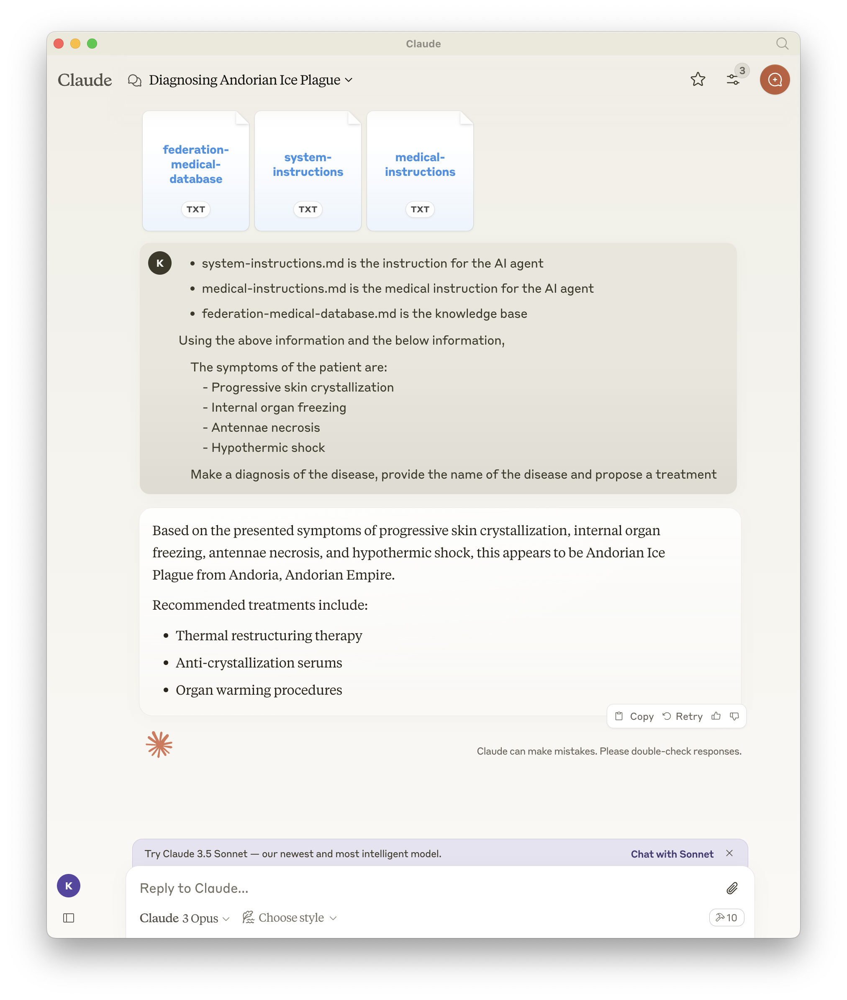
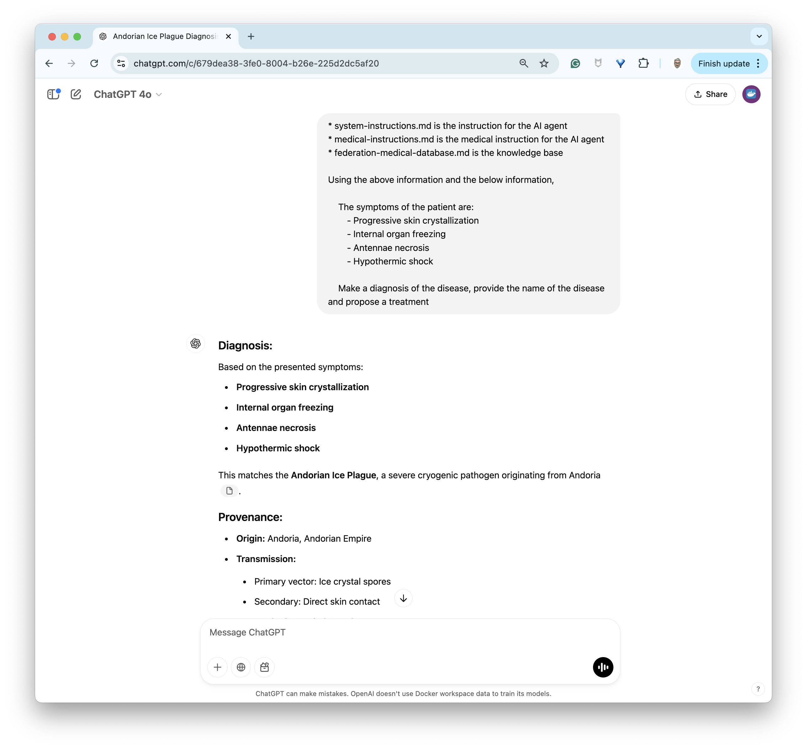
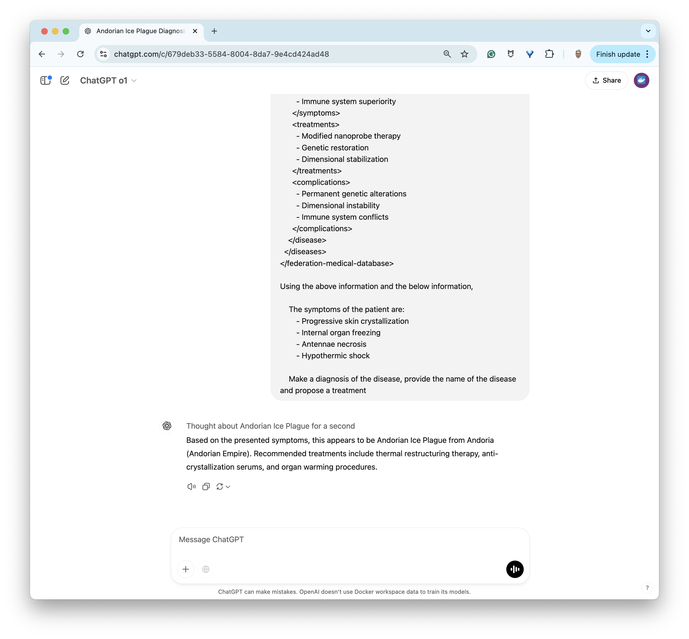
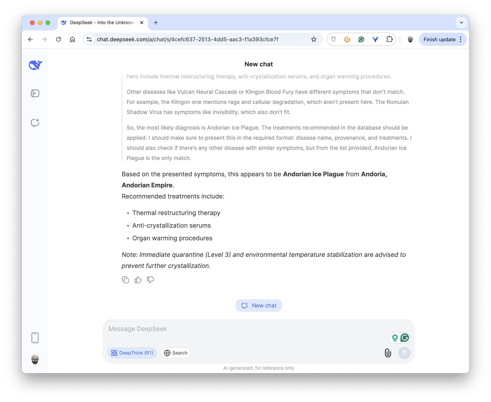
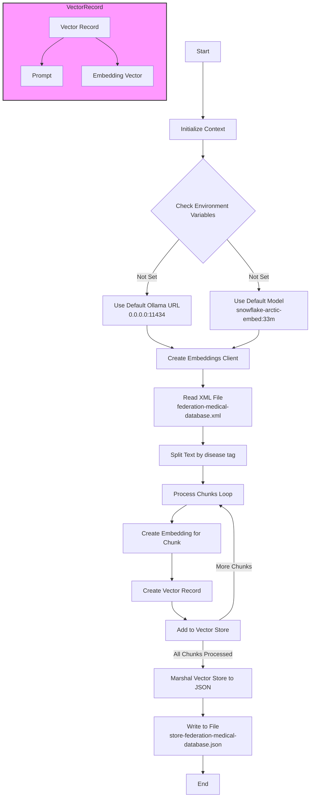
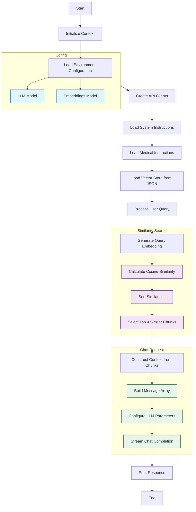

# Can we really do something with deepseek-r1:1.5b?

> - The answer is yes
> - The Go code used for the examples uses Ollama's Go API

## Introduction

The announcement of DeepSeek-R1 in January made headlines. This announcement even had a significant impact on the stock market (for example: drop in NVIDIA's stock market valuation) and raised questions about AI investment amounts (the creation of DeepSeek-R1 was reportedly much less expensive than that of ChatGPT 🙀).

**But what is DeepSeek-R1?**

DeepSeek R1 is an artificial intelligence model launched on January 24, 2025, by the Chinese company DeepSeek. One of its main characteristics is its ability to perform logical reasoning, mathematical problem-solving...

Another characteristic is that this model is **opensource** 🎉 and available in different sizes for [Ollama](https://ollama.com/):

> This table presents the different models with their parameters, sizes, and platforms that I used to test them.

| Parameter | Size | Tested |
|-----------|------|---------|
| 1.5b | 1.1GB | Mac M2 + RPI5 8GB |
| 7b | 4.7GB | Mac M2 |
| 8b | 4.9GB | Mac M2 |
| 14b | 9.0GB | Mac M2 |
| 32b | 20GB | Mac M2 |
| 70b | 43GB | x |
| 671b | 404GB | x |

### Notes:
- Models up to 32b have been tested on Mac M2
- The smallest model (1.5b) also works on Raspberry Pi 5 8GB
- The two largest models (70b and 671b) have not been tested on the listed platforms

> Source: [https://ollama.com/library/deepseek-r1](https://ollama.com/library/deepseek-r1)

If you read me or if you know me, one of my quirks is to demonstrate that we can do generative AI without GPU (trying to save some trees and thinking about geeks who don't necessarily have high-end machines as computers). So my first choice was naturally `deepseek-r1:1.5b`.

✋ **ATTENTION**: keep in mind that the smaller the model, the less "skilled" it will be on complex problems - the objective is to use it on types of problems it will know how to solve.

## First Contact: Let's Do Some Math

I made a small Go program (the source code is available at the end of the paragraph), giving these instructions to the model:

```golang
systemInstructions := `You are an expert in mathematics and you are tutoring a student. 
All the output are in markdown format.
Instructions:
1. Use the EXACT numbers provided
2. Do not round or modify the number
3. Keep ALL decimal places as given
4. Use plain numbers with units
5. Explain the concept without using mathematical notation
6. Describe the solution in simple terms without formulas
`
```

And I tested it with different problems:

**Problem Statement**
```golang
statement := `Given: Rectangle with length 8m, width 4,28m`
userContent := "Question: Calculate the rectangle's area"
```

**Response (reasoning)**:
```raw
<think>
Okay, so I have this problem where I need to find the area of a rectangle. The rectangle has a length of 8 meters and a width of 4.28 meters. Hmm, let me think about how to approach this.

First, I remember that the area of a rectangle is calculated by multiplying its length by its width. The formula is Area = length × width. So, in this case, I need to multiply 8 meters by 4.28 meters.

Let me write that down: Area = 8m × 4.28m. Now, I need to perform this multiplication. I can do this step by myself or use a calculator, but since I'm just thinking through it, I'll try to do it manually.

Multiplying 8 by 4 gives me 32. Then, multiplying 8 by 0.28 gives me 2. So, adding those together, 32 + 2 equals 34. So, the area should be 34 square meters.

Wait, let me double-check that. If I multiply 8 by 4.28, I can also think of it as 8 times 4 plus 8 times 0.28. That would be 32 plus 2. So, yes that's 34. Okay, that seems right.

I don't think I need to round or modify the numbers because the problem says to use the exact numbers provided. So, 34 square meters is the correct area for this rectangle.
</think>
```

**Response (solution)**:
```raw
The area of the rectangle is calculated by multiplying its length by its width. Given the length is 8 meters and the width is 4.28 meters, the area is:

Area = length × width = 8m × 4.28m = 34.24 m²

So, the area of the rectangle is 34.24 square meters.
```

Not bad! 🥰
> In the statements, use `,` rather than `.` to mark decimals, otherwise the model will tend to round or make mistakes with the numbers.

I tried other problems:

**Problem Statement**
```golang
statement := `Given: Circle with radius 5 meters`
userContent := `Problem Calculate area and perimeter of circle. 
Use simple mathematical notation with basic symbols (* for multiplication, × or x, ^ for powers, etc.) 
rather than LaTeX or complex notations.`
```

**Response (solution)**:
```raw
The area and perimeter of a circle with radius 5 meters are calculated using the formulas:

- **Area** = π * r² = π * 5² = 25π square meters ≈ 78.5 square meters
- **Perimeter (Circumference)** = 2π * r = 2π * 5 = 10π meters ≈ 31.4 meters

**Final Answer:**
- Area = 25π m² ≈ 78.5 m²
- Perimeter = 10π m ≈ 31.4 m
```

So, okay, it's pretty good 🤩 (but I wouldn't risk using it to help my son with Math 😉).

> Source code: [00-simple/main.go](https://github.com/ollama-tlms-golang/09-reasoning/blob/main/00-simple/main.go)

## Going Further: Expert System?

I was quite impressed by the capabilities of the small version of **DeepSeek R1**. So I wanted to push it a bit further and find another use case.

My first contact with "AI" goes back to 1984-1985 (I was 15 years old 😢) when, reading a computer magazine, I discovered the principle of **expert systems**: computer programs that imitated human reasoning. They were designed to solve complex problems using a knowledge base (facts and rules) and an inference engine (logical reasoning).



> The operating cycle of an expert system works in two main phases: first a rule selection phase comprising three sequential steps (restriction, filtering, and choice), followed by a deduction phase where the selected rules are activated, then the system returns to the first phase to continue its reasoning cycle.

After reading this article (Micro-Système May 1984 - French magazine) which provided an example in Pascal (readable, but I didn't have a computer), I set about porting it to BASIC (1 or 2 years later) on one of my favorite machines: a Sharp PC Computer, probably the [PC-1260 or 62](https://fr.wikipedia.org/wiki/Sharp_PC-1262) 💖 and tested this program with my biology exercises where we had to do deduction exercises based on observation elements (classification of insects, plants, ...)


> I "did AI again" at university 10 years later and there I used a professional expert system whose name I've forgotten, but the main principles remained the same.

But why am I telling you about this? Well, actually, it was while observing **DeepSeek R1** "thinking" that these distant memories came back. What if I used **DeepSeek R1** as a kind of expert system!? 🤔

### Let's Get Started! We Need a Knowledge Base

I'll need to feed my "expert system" with data. In the field of machine learning, there's a dataset often used as an example: the **[Iris database](https://dataverse.harvard.edu/dataset.xhtml?persistentId=doi%3A10.7910%2FDVN%2FR2RGXR)** (created by botanist Ronald Fisher in 1936). This database contains 150 observations of iris flowers. Each observation includes four measurements:
  - Sepal length
  - Sepal width
  - Petal length
  - Petal width

And these measurements allow classification of irises into three different species:
  - Iris setosa
  - Iris versicolor
  - Iris virginica

#### Tests without Knowledge Base

I first did some tests without giving additional information to the model:

##### 1st test

```raw
Using the below information, 
Given a specimen with:
  - Petal width: 2,5 cm
  - Petal length: 6 cm
  - Sepal width: 3,3 cm
  - Sepal length: 6,3 cm
What is the species of the iris?
```

**DeepSeek R1's Reasoning**:
```raw
<think>
Alright, let me work through this step by step. I have these measurements for a particular iris:

- Petal width: 2.5 cm
- Petal length: 6.0 cm
- Sepal width: 3.3 cm
- Sepal length: 6.3 cm

First, I need to recall the common species of irises and their typical measurements. There are three main types:

1. **Iris setosa**: This is the most common species, often referred to as "common iris." It has relatively narrow sepals and 
a small petal width.
   
2. **Iris versicolor**: Also known as "dull variety," this species typically has slightly wider sepals compared to setosa 
and more robust petals.

3. **Iris virginica**: This is the more common of the two, often called the "tall variety." It has longer separals (spans) 
compared to setosa.

Now, looking at the measurements:

- Sepal width: 3.3 cm
- Sepal length: 6.3 cm

These values seem to align with **Iris setosa** because I believe setas are generally narrower and shorter than virginica or 
versicolor.

Next, petal measurements:

- Petal width: 2.5 cm
- Petal length: 6.0 cm

Petal widths of around 2.5 cm sound typical for setosa species.

Given that all the measurements fit well with the characteristics of **Iris setosa**, it makes sense to conclude that this 
specimen is most likely an Iris setosa.
</think>

Based on the provided measurements, the flower has petal width of 2.5 cm and petal length of 6.0 cm, which are typical for 
**Iris setosa** species. The sepals (sepal width at 3.3 cm and sepallength at 6.3 cm) also align with setosa's narrow, 
relatively short separals.

### Answer
The species is likely **Iris setosa**.
```

The correct answer (according to the Iris database) is `Iris Virginica` but `deepseek-r1:1.5b` suggests `Iris setosa` 😢

##### 2nd test

```raw
Using the below information, 
Given a specimen with:
  - Petal width: 1,5 cm
  - Petal length: 4,5 cm
  - Sepal width: 3,2 cm
  - Sepal length: 6,4 cm
What is the species of the iris?
```

The correct answer (according to the Iris database) is `Iris versicolor` but `deepseek-r1:1.5b` suggests `Iris setosa` 😢

Apparently, `deepseek-r1:1.5b` knows the different iris species (based on what it showed me in its reasoning logs), it knows how to reason using flower measurements, but doesn't have the same information as I do (the Iris database) or needs guidance. So I'm going to help it a little.

#### Guidance Instructions and Rules

I performed the same tests but this time providing detailed instructions to the model (deduced from the Iris database):

```markdown
You are an expert with iris species
# Instructions for Iris Species Classification

As an LLM tasked with iris species classification, you must follow these steps to analyze the four key measurements and determine the species (Setosa, Versicolor, or Verginica).

## Input Features
You will be given four numerical measurements:
1. Petal width (in cm)
2. Petal length (in cm)
3. Sepal width (in cm)
4. Sepal length (in cm)

## Classification Process

### Step 1: Primary Feature Analysis
First, examine the petal measurements as they are the most discriminative features:
- Setosa has distinctively small petals
  - Petal length < 2 cm
  - Petal width < 0.5 cm

### Step 2: Secondary Feature Analysis
If the specimen is not clearly Setosa, analyze the combination of features:

For Versicolor:
- Petal length typically between 3-5 cm
- Petal width between 1.0-1.8 cm
- Sepal length typically between 5-7 cm
- Sepal width typically between 2-3.5 cm

For Verginica:
- Petal length typically > 4.5 cm
- Petal width typically > 1.4 cm
- Sepal length typically > 6 cm
- Sepal width typically between 2.5-3.8 cm

### Step 3: Decision Making
1. If petal measurements match Setosa's distinctive small size → Classify as Setosa
2. If measurements fall in the intermediate range → Classify as Versicolor
3. If measurements show larger values, especially in petal length → Classify as Verginica

### Step 4: Confidence Check
- Consider the clarity of the distinction:
  - Are the measurements clearly in one category's range?
  - Are there any overlapping characteristics?
  - Express any uncertainty if measurements are in borderline ranges

### Step 5: Explanation
Provide reasoning for your classification by:
1. Highlighting which measurements were most decisive
2. Explaining why certain features led to your conclusion
3. Noting any unusual or borderline measurements

## Example Reasoning
"Given a specimen with:
- Petal width: 0.2 cm
- Petal length: 1.4 cm
- Sepal width: 3.5 cm
- Sepal length: 5.1 cm

Classification process:
1. The very small petal measurements (width 0.2 cm, length 1.4 cm) are highly characteristic of Setosa
2. These petal dimensions are well below the ranges for Versicolor and Verginica
3. The sepal measurements support this classification, being in the typical range for Setosa
4. Confidence is high due to the distinctive petal size

Therefore, this specimen is classified as Setosa with high confidence."
```

Well, I got better results, but the answers weren't always correct. 🤔 So I still had to try to "propose" the entire Iris database to the model. This database isn't very large, it corresponds to 150 measurements, which should remain reasonable for `deepseek-r1:1.5b`.

#### Adding the Iris Database

I converted the Iris database into an XML format of this type:

```xml
<irisDataset>
    <metadata>
        <attributes>
            <attribute>Species_No</attribute>
            <attribute>Petal_width</attribute>
            <attribute>Petal_length</attribute>
            <attribute>Sepal_width</attribute>
            <attribute>Sepal_length</attribute>
            <attribute>Species_name</attribute>
        </attributes>
    </metadata>
    <records>
        <iris>
            <Species_No>1</Species_No>
            <Petal_width>0,2</Petal_width>
            <Petal_length>1,4</Petal_length>
            <Sepal_width>3,5</Sepal_width>
            <Sepal_length>5,1</Sepal_length>
            <Species_name>Setosa</Species_name>
        </iris>
        ...
```

You can find the complete file here:
- XML format: [01-iris/iris-database.xml](https://github.com/ollama-tlms-golang/09-reasoning/blob/main/01-iris/iris-database.xml)
- CSV format: [01-iris/Iris/iris.csv](https://github.com/ollama-tlms-golang/09-reasoning/blob/main/01-iris/Iris/iris.csv?plain=1)

I then created a Go program (you'll find the link to the source code at the end of the paragraph), and performed tests again. This time the results seem much more reliable (at the time of writing, I have 100% correct answers 🎉).

This is new "proof" that if you properly guide a "baby LLM", you can get interesting and useful results.

> Source code: [01-iris/main.go](https://github.com/ollama-tlms-golang/09-reasoning/blob/main/01-iris/main.go)

## Going Even Further with a Larger Knowledge Base

Now that I knew `deepseek-r1:1.5b` could be useful for something, I wanted to go a bit further with a larger knowledge base. This time, I asked [Claude.ai](https://claude.ai/) to generate a medical knowledge base about existing diseases in Federation planets (I'm talking about Star Trek 🖖, so a completely fictional database).

> You can find this database in XML format here: [02-star-trek/federation-medical-database.xml](https://github.com/ollama-tlms-golang/09-reasoning/blob/main/02-star-trek/federation-medical-database.xml)

I then tested this database with **Claude 3 Opus**, **ChatGPT 4o**, **ChatGPT o1**, and the online version of **[DeepSeek R1](https://chat.deepseek.com/a/chat)** (imagine my cognitive dissonance at this moment, but it's for a worthy cause: helping "baby LLMs").

All four models passed with flying colors in diagnosing an **Andorian ice plague**:

**Claude 3 Opus**:


**ChatGPT 4o**:


**ChatGPT o1**:


**DeepSeek R1 (online version)**:


So I tested with the "local" versions of **DeepSeek R1** with Ollama, and there, big disappointment, none of the models below were able to correctly diagnose the **Andorian ice plague** 😭:

| Parameter | Size | Result |
|-----------|------|---------|
| 1.5b | 1.1GB | 👎 |
| 7b | 4.7GB | 👎 |
| 8b | 4.9GB | 👎 |
| 14b | 9.0GB | 👎 |
| 32b | 20GB | 👎 |

My first hypothesis was that the database was too "large" and that `deepseek-r1` had trouble properly processing the information (I haven't tried different data formatting and instructions). And so I would need to help `deepseek-r1` a bit more to transform it into a worthy xenobiologist doctor. And for that, I'm going to use the **RAG** (retrieval-augmented generation) technique.

> Source code for this part: [02-star-trek/main.go](https://github.com/ollama-tlms-golang/09-reasoning/blob/main/02-star-trek/main.go)

## Going Even Further with a Large Knowledge Base and RAG

### Embeddings

I started by creating a Go program to split the disease database into "chunks" and create embeddings from these (I used the [snowflake-arctic-embed:33m](https://ollama.com/library/snowflake-arctic-embed:33m) model to calculate the vectors). And I saved the vectors and associated chunks in a JSON file `store-federation-medical-database.json`.



> - The source code is available here [03-star-trek-rag/chunking_test.go](https://github.com/ollama-tlms-golang/09-reasoning/blob/main/03-star-trek-rag/chunking_test.go), and you just need to run it with the `go test` command (in the program directory).
> - The vector database is here: [03-star-trek-rag/store-federation-medical-database.json](https://github.com/ollama-tlms-golang/09-reasoning/blob/main/03-star-trek-rag/store-federation-medical-database.json)

### Similarity Search

I then created a second Go program to perform similarity search in the vector database based on disease symptoms; this can be seen as a first filter that allows me to reduce the context of information to pass to the model, and then pass this reduced context to the model to obtain a diagnosis. This program uses "Cosine Similarity" to search for chunks closest to the user prompt.



> The source code is available here [03-star-trek-rag/main.go](https://github.com/ollama-tlms-golang/09-reasoning/blob/main/03-star-trek-rag/main.go), and you just need to run it with the `go run main.go` command (in the program directory).

I then ran this new program with `deepseek-r1:1.5b` 🐣 and the following symptoms:

```golang
userContent := `Using the above information and the below information, 

The symptoms of the patient are:
    - Progressive skin crystallization
    - Internal organ freezing
    - Antennae necrosis
    - Hypothermic shock

Make a diagnosis of the disease, provide the name of the disease and propose a treatment
`
```

And the diagnosis was correct! 🎉:
```raw
The patient's symptoms are most consistent with Andorian Ice Plague. Here's the diagnosis and treatment plan:

**Disease Name:** Andorian Ice Plague  
**Provenance:** Andorian Empire  
**Classification:** Cryogenic pathogen, Severe, Level 3  
**Transmission:** Primary vector: Ice crystal spores, Secondary: Direct skin contact  
**Incubation:** 2-5 days  
**Symptoms:** Progressive skin crystallization, Internal organ freezing, Antennae necrosis, Hypothermic shock  
**Treatments:** Thermal restructuring therapy, Anti-crystallization serums, Organ warming procedures

The patient's symptoms align perfectly with the known profile of Andorian Ice Plague, making this the most likely diagnosis. The treatments provided are appropriate for managing hypothermic shock and associated conditions, ensuring effective management of the patient's symptoms.
```

🙂 It seems that at minimum, `deepseek-r1:1.5b` knows how to diagnose **Andorian ice plague**.

Lucky shot? So I tested with fewer symptoms (removing `Antennae necrosis`, antennae being a specificity of Andorians). Here too, I got a correct diagnosis:

```raw
**Diagnosis: Andorian Ice Plague**

**Symptoms:**
- Progressive skin crystallization
- Internal organ freezing
- Hypothermic shock

**Treatment Plan:**
- **Thermal Restructuring Therapy:** This involves cooling the affected area to prevent the pathogen from replicating and spreading. This is crucial for managing the hypothermic shock and addressing the progressive skin crystallization.
- **Anti-Crystallization Serums:** These are used to manage the crystallization process, helping to slow down the replication of the pathogen and reduce the risk of further complications.

The Andorian Ice Plague is the most likely diagnosis due to the presence of hypothermic shock, which is a hallmark of cryogenic pathogen issues. The treatment focuses on cooling and managing the crystallization process to effectively treat the patient.
```

😂 It seems we have a specialist in **Andorian ice plague**. But let's continue testing.

Here are the symptoms of **Betazoid empathic overload** 🤪
```golang
userContent := `Using the above information and the below information, 

    The symptoms of the patient are:
        - Uncontrolled emotion reading
        - Psychic barrier breakdown
        - Mental exhaustion
        - Emotional flooding

    Make a diagnosis of the disease, provide the name of the disease and propose a treatment
`
```

And here's the diagnosis and treatment made and proposed by `deepseek-r1:1.5b`:
```raw
The patient's symptoms align most closely with the disease **Betazoid Empathic Overload**. This diagnosis is supported by the following:

- **Disease Name:** Betazoid Empathic Overload
- **Provenance:** The Federation Medical Database confirms this diagnosis.
- **Treatment Recommendations:**
  - **Psychic Shielding Therapy:** To address emotional trauma.
  - **Emotional Dampening:** To reduce emotional control.
  - **Mental Reconstruction:** To rebuild emotional resilience.

This diagnosis is supported by the patient's symptoms, which include uncontrolled emotion reading, psychic barrier breakdown, and emotional flooding.
```

I did other conclusive tests (I'll let you try on your side), and so I didn't try with `deepseek-r1:1.5b`'s big brothers because my initial objective was achieved: `deepseek-r1:1.5b` can indeed be useful. 🎉🙌

## Conclusion

So once again, even small models, for specific and well-determined uses are effective if they are used wisely with relevant guides and appropriate data. And therefore at lower cost.

*"🖖 May logic and ethics guide our algorithms towards collective prosperity"* 😉
